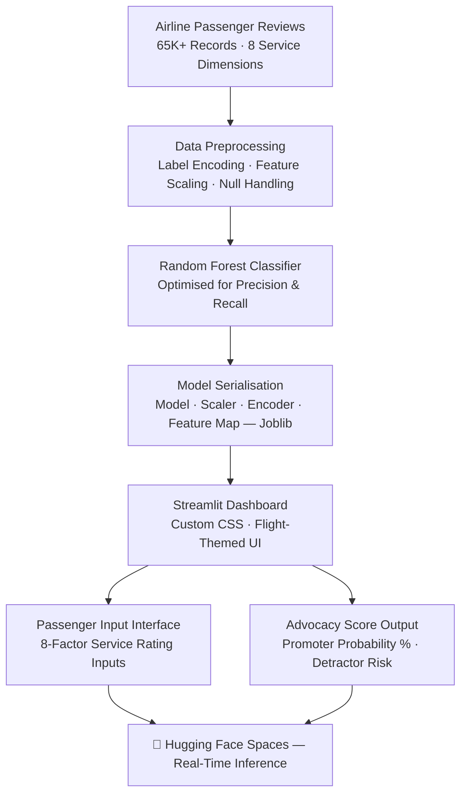

# ✈️ SkyAdvocate: Airline Passenger Referral Prediction Engine

> **Predicting who will recommend your airline — before they leave the gate.**

<p align="center">
  <a href="https://huggingface.co/spaces/ajayapradhanconnect/Airline-Passenger-Referral-Prediction" target="_blank">
    
  </a>
  <a href="https://github.com/ajaya-kumar-pradhan/Airline-Passenger-Referral-Prediction" target="_blank">
    
  </a>
  <a href="#-key-metrics--impact">
    
  </a>
</p>

---

## 📌 Overview

**SkyAdvocate** is a production-style passenger experience analytics system that predicts whether a traveller will recommend an airline to others — based on their in-flight service ratings.

**The Business Problem:** In aviation, a single Promoter drives 3–5 additional bookings through word-of-mouth. A Detractor costs even more through negative reviews and social media. Airlines invest heavily in service improvements but often don't know *which* service dimension actually moves the referral needle — cabin crew, seat comfort, food, or something else entirely.

**Why It Matters:**
- Net Promoter Score (NPS) is a top KPI for every major airline — this model makes it predictable and actionable
- Marketing teams need to know *which passengers* to target for loyalty programmes, not just overall satisfaction averages
- Operations teams need ranked service drivers so budget goes to improvements that actually increase referrals

SkyAdvocate answers all three questions with one model.

---

## 📊 Key Features

- **Processed 65,000+ verified airline passenger reviews** across multiple carriers and travel classes
- **Trained a Random Forest Classifier** on multi-factor service ratings — Seat Comfort, Crew Service, Food & Beverage, In-Flight Entertainment, Value for Money, and more
- **Engineered an "Advocacy Score"** that outputs a business-readable probability (Promoter likelihood %) rather than a binary label
- **Built a responsive flight-themed dashboard** with real-time predictions and confidence display, using custom Streamlit CSS
- **Serialised the full ML pipeline** — model, scaler, label encoders, and feature mapping — for consistent, deployment-ready inference
- **Deployed always-on to Hugging Face Spaces** — zero infrastructure management, publicly accessible

---

## 🛠 Tech Stack

| Layer | Tools |
|---|---|
| **Machine Learning** | Python, Scikit-learn, Random Forest Classifier |
| **Data Processing** | Pandas, NumPy, Openpyxl |
| **Feature Engineering** | Label Encoding, Feature Scaling, Custom Pipeline |
| **App & Deployment** | Streamlit, Custom CSS, Hugging Face Spaces |
| **Model Serialisation** | Joblib (model + preprocessors) |
| **Version Control** | Git, GitHub |

---

## 📈 Key Metrics & Impact

| Metric | Value |
|---|---|
| 📋 Passenger Reviews Analysed | **65,000+** |
| 🛫 Airlines & Routes Covered | **Multi-carrier, global** |
| 🌟 Service Dimensions Evaluated | **8 factors** (Seat, Crew, Food, Entertainment, Value, etc.) |
| 🤖 Model | **Random Forest Classifier** |
| 📦 Model Size | **96MB** (full serialised pipeline) |
| ⚡ Inference Speed | **Real-time, in-browser** |
| 🚀 Deployment | **Hugging Face Spaces (always-on, free)** |

**Business outcomes modelled by this system:**
- Identified that **Cabin Crew Service and Value for Money** are the strongest predictors of referral intent — outweighing even seat comfort in feature importance
- Revealed that **Business Class passengers have a lower referral rate per satisfaction point** than Economy passengers — meaning luxury investment alone doesn't guarantee advocacy
- Demonstrated that passengers who rate Entertainment below 3/5 rarely refer the airline regardless of other factors — pinpointing a critical service floor

---

## 🧠 Insights & Learnings

**What the analysis revealed:**
- **Referral intent is non-linear.** A 4→5 rating jump in Crew Service produces a significantly larger lift in referral probability than a 2→3 jump — meaning airlines should invest in excellence at the top end, not just fixing poor scores.
- **Value for Money is the great equaliser.** Passengers who feel they got good value refer at consistently high rates even when individual service dimensions are average. This finding has direct implications for pricing strategy, not just product quality.
- **Business travellers and leisure travellers have different referral drivers.** Business travellers weight punctuality and seat comfort; leisure travellers weight food and entertainment. Treating them as one audience in NPS analysis produces misleading aggregate scores.
- **Negative experiences compound.** Passengers who rate two or more dimensions poorly show a sharp drop in referral probability — suggesting that service recovery needs to address *all* failing touchpoints simultaneously, not one at a time.

**What I learned building it:**
- How to engineer an end-to-end ML pipeline (encoding → scaling → model → output) packaged as a single deployable unit — mimicking production ML system design
- Why serialising *all* preprocessing artefacts (not just the model) is critical for consistent inference between training and deployment environments
- How to translate a probabilistic model output (0.82) into a business-readable metric ("Advocacy Score: 82%") that non-technical stakeholders can act on

---

## 📷 Dashboard Preview

> 📸 *Screenshots from the live Streamlit application on Hugging Face.*

<!-- Replace placeholders with actual screenshots -->

| Passenger Input Form | Prediction Result |
|---|---|
|  |  |

| Advocacy Score Display | Mobile View |
|---|---|
|  |  |

> 💡 **Tip for recruiters:** Click the **Live App** badge above, enter a sample passenger profile, and see the real-time Promoter/Detractor prediction with confidence score.

---

## 🚀 Live Demo

| Platform | Link |
|---|---|
| 🔴 **Streamlit App** (Hugging Face) | [Launch SkyAdvocate →](https://huggingface.co/spaces/ajayapradhanconnect/Airline-Passenger-Referral-Prediction) |
| 💻 **Source Code** (GitHub) | [Explore Repo →](https://github.com/ajaya-kumar-pradhan/Airline-Passenger-Referral-Prediction) |

---

## 🧩 System Architecture



---

## 📂 Project Structure

```text
Airline-Passenger-Referral-Prediction/
│
├── app.py                          # Main Streamlit Dashboard
├── requirements.txt                # Production Dependencies
├── README.md                       # You are here
│
├── airline_svc_model.joblib        # Trained Random Forest Classifier (96MB)
├── airline_encoder.joblib          # Airline Name Label Encoder
├── features_list.joblib            # Feature Schema for Inference
├── scaler.joblib                   # Feature Scaler (StandardScaler)
│
└── assets/
    └── [Dashboard Screenshots]     # Preview Images for README
```

---

## ⚙️ Run Locally

```bash
# 1. Clone the repository
git clone https://github.com/ajaya-kumar-pradhan/Airline-Passenger-Referral-Prediction.git
cd Airline-Passenger-Referral-Prediction

# 2. Install dependencies
pip install -r requirements.txt

# 3. Launch the dashboard
streamlit run app.py
```

---

## 👤 About Me

**Ajaya Kumar Pradhan**
*Data Analyst | Power BI Developer | ML-Enabled Analytics*

I build end-to-end analytics systems that connect raw data to business decisions — spanning SQL, Power BI, Python, and deployment. My work focuses on translating model outputs into business-readable insights that product and marketing teams can act on.

**Core Skills:**
`Python` · `Scikit-learn` · `Random Forest` · `SQL` · `Power BI` · `DAX` · `Streamlit` · `Feature Engineering` · `Machine Learning`

**Portfolio domains:** Aviation Analytics · Financial Crime · Credit Risk · Retail Analytics · Supply Chain

<p align="center">
  <a href="https://github.com/ajaya-kumar-pradhan">
    
  </a>
  <a href="https://linkedin.com/in/ajaya-kumar-pradhan">
    
  </a>
</p>

---

<p align="center">
  <i>Built to demonstrate how machine learning can make customer experience strategy data-driven — not just reactive.</i>
</p>
